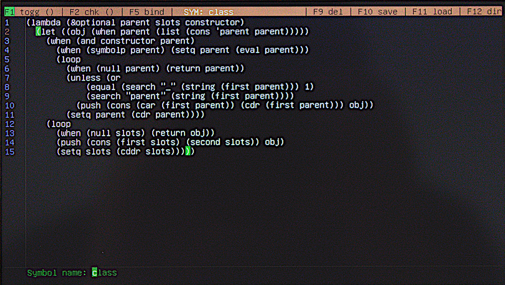
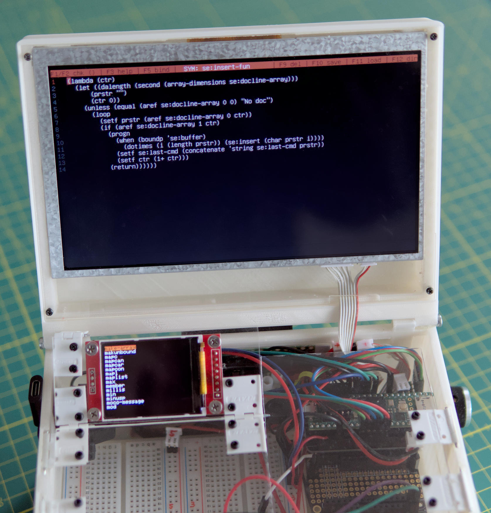

# ulisp-lispbox
Modified version of ulisp-arm (see below) for use with a self-contained uLisp computer based on the Teensy 4.1, a TFT screen with RA8875 controller and an USB keyboard. The REPL works locally and via serial connection simultaneously and prints to the TFT as well.

**ADDENDUM:** Added "Lispy Little Helper", please see below screenshot

Contains several modifications to the ulisp-arm version (many based on the uLisp firmware for the LilyGO T-Deck)
as well as a set of suitable uLisp extensions including RFM69 support and a Lisp library providing an extended ULOS system, the most important parts of a uLisp port of ErsatzMoco (github.com/ersatzmoco/ersatzmoco) and a full-screen uLisp and text editor.
The editor features full SD card support, direct binding to uLisp symbols, full bracket matching and some keyboard shortcuts
partially compatible with EMACS:

* CTRL-q / CTRL-c --- quit editor and return to REPL
* CTRL-x / CTRL-b / CTRL-n --- discard current text buffer (i.e. new file)

* CTRL-k / CTRL-l / ALT-x --- delete line starting at cursor position (deleted part is copied before)
* ALT-c --- copy current line
* ALT-v --- insert copy buffer at cursor position

**Note:** ALT-v also serves as a rudimentary undo. If you accidentally delete part of a line using CTRL-k, CTRL-l or ALT-x you can insert that part again using ALT-v. 

* CTRL-a / HOME --- move cursor to start of line
* CTRL-e / END --- move cursor to end of line
* ^ --- move cursor to beginning of buffer
* PG UP/PG DOWN --- move one page up or down

* F1 --- toggle bracket matching on/off
* F2 --- check whether bracket under the cursor has a matching bracket in the buffer. If so, both are temporarily highlighted. (Use when continuous bracket matching is off.)
* F3 --- invoke "Lispy Little Helper" if applicable, see below
* F5 --- bind contents of the text buffer to a symbol of your choice and quit editor
* F8 --- save current buffer to backup file "BACKUP.CL" (overwriting old backup file). This is intended as a quick save function to prevent the worst case scenario of running out of battery before having saved your current work. It is recommended to use F8 at regular intervals.
* F9 --- delete a file on the SD card
* F10 --- save text buffer to SD card
* F11 --- load text from SD card into buffer, discarding the present one
* F12 --- show directory of SD card
Note: file names for SD card follow the 8.3 standard and thus must be given in capital letters. 

* ALT-0 to ALT-9 --- insert one of up to ten predefined snippets at cursor position
The snippets are defined in function `se:init` and reside in the global variable `se:sniplist` during runtime of the editor. You may change them according to your needs in file "LispboxLibrary.h" (re-flash your MCU with this firmware after change).

The editor is written in uLisp. To invoke it type

(se:sedit)  or  (se:sedit 'symbol) where "symbol" can be any symbol name already present in uLisp

# ADDENDUM

The Lisp Library of the Lisp Box now contains "Lispy Little Helper". This is a gadget using a KY-040 rotary encoder and a small second TFT display with ST7735 driver chip (see photo below, encoder on the right placed behind and below the Teensy). The default settings use a resolution of 160x128 pixels.

The Lispy Little Helper collects built-in help information of uLisp symbols as a kind of virtual Rolodex lexicon, accessible from the REPL and the fullscreen editor as well. 

*If you do not intend to use this addendum, please set variable "se:help-active" to nil. This is done either by modifying the first active line of the Lisp Library (file LispboxLibrary.h) before uploading the firmware to your Teensy or by executing (setf se:help-active nil) in the REPL after startup.*

If you want to add the Lispy Little Helper to your Lisp Box, connect the rotary encoder and the display to the following pins (you may change them within the function `se:help`):

**Encoder:** "+" to 3.3V, "GND" to GND, "CLK" to pin 16, "DT" to pin 14, "SW" to pin 20.

**Display** (using the default SPI port): "SCK" to SCK (pin 13), "SDA" to MOSI (pin 11), "CS" to pin 9, "A0" to pin 6, "RST" to pin 8 and LED to pin 5.

**Usage of Lispy Little Helper:**

The help screen works both within the fullscreen editor and with the REPL. In the editor, you can access the lexicon by pressing "F3". The TFT display is activated with the message: `Press key or encoder!` If you press an alphanumeric key on the USB keyboard, a scrollable list of all uLisp symbols that begin with the chosen character will appear. If there are none, `No entry` will be displayed. If instead of pressing a key, you directly turn or press the encoder, the list of *all* symbols currently included in uLisp will appear, i.e., functions and global variables.

Now turn the encoder until the entry you want to view is highlighted. Press the encoder, and the display will show the help text for it, if available. For example, if it is a global variable, which naturally does not have help text, the display will show `No doc`. Most help texts also provide a function prototype, which is an empty dummy of the correct function call. If you press the encoder again from the help text, this function prototype will be directly written into the fullscreen editor, and the lexicon will return to the list.

If you type a starting letter in the help text (or in the list) instead, the corresponding list will be shown. Pressing "F3" again will exit the helper. 

To use it in the REPL, enter `(se:help)` [Enter] - the rest works as described. With one exception: when you press the encoder in the help text, the function prototype will not be output. Instead, the lexicon remembers all function prototypes you view and outputs them when you exit the helper (also with "F3") as feedback in the REPL, so you have them as a reminder and can type them accordingly if needed.

Lisp Box firmware is based on ulisp-arm by David Johnson-Davies:
# ulisp-arm
A version of the Lisp programming language for boards based on the ARM processor:

* Arduino Zero and MKRZero.
* Arduino Uno R4 Minima and WiFi.
* Adafruit ItsyBitsy M0, Feather M0, and Gemma M0.
* Adafruit Metro M4, ItsyBitsy M4, Feather M4, and Grand Central M4.
* Adafruit PyBadge and PyGamer.
* Adafruit CLUE and ItsyBitsy nRF52840.
* Raspberry Pi Pico and Raspberry Pi Pico W.
* BBC Micro Bit.
* Maxim MAX32620FTHR.
* Teensy 4.0/4.1.

For more information see: http://www.ulisp.com/
